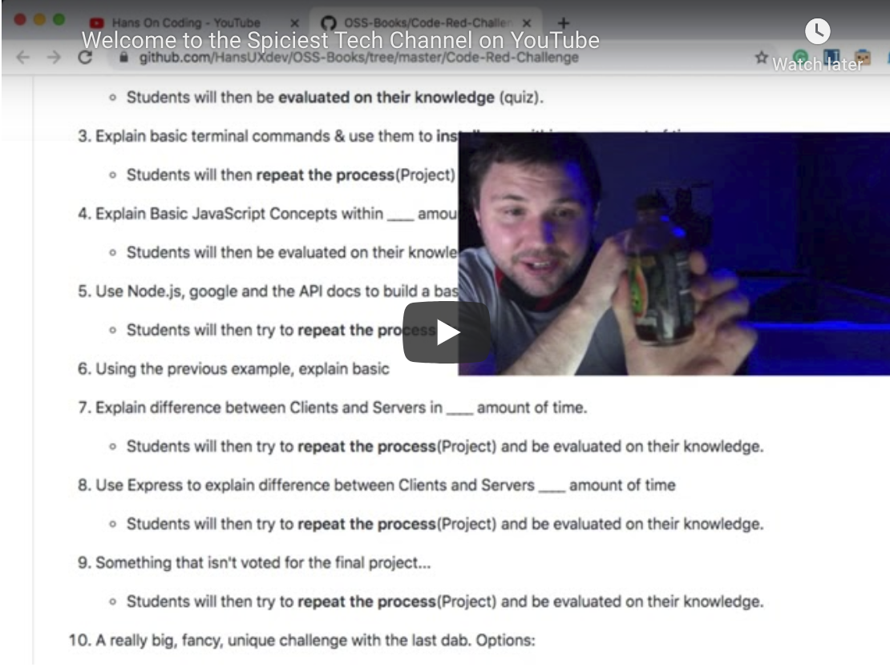

# OSS BOOK(S)

Open Source Book(s) is a long term project with the following objectives:
1. Create & Maintain open source curriculum designed to teach anyone 16+ how to use JavaScript as the primary language to build a web site, server, mobile app or hardware device (J5).
2. Promote content via social media, events and invite contributors and 🤞 supporters.
3. Sell Content to (For-Profit) Educational Institutions --> Profit --> Donate 4G Computers to underprivileged kids.


[](https://creativecommons.org/licenses/by-nd/4.0)


[](https://twitter.com/hansonconsult) 


## Content Published on:
<a href="https://medium.com/@hansOnConsult" class="MEDIUM">
   
</a>
<a href="https://dev.to/hansuxdev" class="DEV TO">
   
</a>
<a href="https://www.youtube.com/channel/UCCGfELkPCJg1XHxQfFFz7pw/about" class="YOUTUBE">
   
</a>

## Social:
<a href="https://www.linkedin.com/in/brett-hans-mcmurdy/" class="LINKEDIN">
   
</a>
<a href="https://twitter.com/HansOnConsult" class="TWITTER">
   
</a>


<!-- <a href="">

</a> -->


# Philosophy
```
Knowledge should NEVER be locked behind a paywall if an educational organization’s objects are student empowerment, quality education or bridging a skill gap in a given industry. 
```
The goal with this is to reduce the overall cost involved in buying, selling, and developing coding content, while also improving the quality of the content by open sourcing it.


## Questions we should be asking Educational Institutions:
* Where is the unique value proposition of any educational organization? 
  * Is it the content, or rather the delivery platform (in person / online) and quality of instructors?
* If content knowledge is locked behind a paywall, how are your empowering students or improving the quality education? 
* What organization wants to waste thousands of dollars by constantly buying, selling or suing over content? 


# Content Rights & Funding
General Rules for the content.
1. Anyone is able to use the content for their own self-taught educational needs.
2. Any organization is able to link to this as a resource for their students to use freely and without penalty, however...
3. No organization, or educator is allowed to use this content or teach the content, without becoming a contributor. A "contributor" could mean any of the following:
   - Contributing to project's [funding](https://github.com/sponsors/HansUXdev) (any tier).
   - Contributing directly to the content with PR's.
   - Advocating the adoption of the content by your organization and promoting it on social media.
   - Creating a "student ambassador" role in your classroom to help maintain a branch for your organization (professional development)
   
## Rights Reserved
The content is currently under Creative Commons Zero v1.0 Universal but that could change (I'm not a lawyer and I'm not interest in getting rich off this). 

I do however work a lot on this and have bills to pay so please consider checking out the [sponsorship page](https://github.com/sponsors/HansUXdev) and read about the [#Code-Red-Challenge](https://github.com/HansUXdev/OSS-Books/tree/master/Code-Red-Challenge) promotional coding challenge by clicking the gif.

[](https://github.com/HansUXdev/OSS-Books/tree/master/Code-Red-Challenge)

# About the spiciest YouTube Channel
Hans On Coding is a channel dedicated to everything related to coding, web development, programming, and a dash of spicy peppers, design and a little bit of everything else in between.

[](https://www.youtube.com/watch?v=HN5OLOthkLg&t=1s)

The channel will feature the following types of videos:
1. Podcasting / Interviews with Industry Professionals
2. Coding Events & Fun Challenges 
3. Coding Tutorials
4. JavaScript-based Hardware projects
5. Open Source Coding Curriculum (this whole repo)

# Notes
I've never written a book before so any and all feedback or contributions are highly appreciated.
I'll even welcome trolls at this point (regret it later)...
If you like one and want to contribute there are a bunch of ways you can help. Some Examples:
* Writing an article on it, 
* making a fancy slideshow, 
* or an assessment quiz (for technical interviews)


## Books
I have 4 broad subjects I want to cover .
1. JavaScript-First
   - Scope: 
   Node.js -->Terminal Commands, NVM & Git -->JavaScript Fundemental-->Node Website-->ClientVSServer-->Express-->JSX --> JSS --> React
   - The idea here is to teach CS in way that is accessible and doesn't drive people away from it and also without the oversimplified approach of teaching HTML/CSS first. JavaScript is a good middle ground because its a dynamic language that can be used anywhere a runtime environment is installed (node/deno). You can still teach programming concepts as well as web design.
2. Frontend-Foundations
   - Scope: HTML --> CSS --> SCSS--> JSX --> JSS --> React, 
   - The idea here is to teach enough HTML, CSS to appreciate it and not be afraid.
3. Docker Databases
   - The idea with this is to teach full-stack development with simple, scalable solutions.
   - Focuses on security practices, learning database design, dockerizing node applications, etc.
4. JavaScript Mobile Apps
   - Scope: TypeScript --> Deno --> React Ionic --> React-Native
   - The idea here is to teach TypeScript and more OOP standards using app development so the transition into C#, Java, etc is easier in college.
5. JavaScript Hardware 
  - Scope: (JohnnyFive) --> J5 --> 3D Printing, ____ (NEED THE MOST HELP HERE)
   - The idea is use JavaScript to teach some basic electrical engineering concepts and cater more to kinesthetic learners.
   - 
Check out the [project boards](https://github.com/HansUXdev/OSS-Books/projects) to get a better idea of the scope of topics I want to cover. The [Medium Distribution](https://github.com/HansUXdev/OSS-Books/projects/5) is an outline to help me keep track of articles, I will personally publish. The other boards are used for 


## Introduction with JavaScript
* [Overview](https://medium.com/@HansOnConsult/learn-how-to-code-in-2020-52bed38a2987?source=friends_link&sk=c486058e202a22900f6106a80c30c7b2)
* [Chapter 1: A breif History of JavaScript JS](https://medium.com/javascript-in-plain-english/a-brief-history-of-javascript-9289a4d344d2?source=friends_link&sk=e99b98fd76bf99dcc6fd1a85e60b4721)
* [Chapter 2: Learn Terminal by Installing NVM](https://medium.com/swlh/terminal-basics-and-installing-nvm-node-js-631cf9476ac4)
* [Chapter 3: What do you really know about Variables, Data Types and Immutability?](https://medium.com/javascript-in-plain-english/what-do-you-really-know-about-variables-data-types-and-immutability-in-javascript-1730835a9e87)

**Soon to be released chapters**
* [Chapter X: Debugging]()
* [Chapter X: Functions]()
* [Chapter X: Objects, Arrays and Methods of Iteration]()
* [Chapter X: Building your first website entirely in JavaScript]()

## HTML & CSS Sections
* [Chapter X: Best Practices for Front-End Development: Introduction to HTML, CSS & JS]()
* [How to create an Animated Star Rating with just CSS](https://medium.com/javascript-in-plain-english/how-to-create-an-animated-star-rating-with-just-css-4df50286ea4b?source=friends_link&sk=5184575c98b541f0bd1b920d607b2416)

**To be released laters**
* [Chapter X: Functional Programming with Javascript]()
* [Chapter X: Object Oriented Javascript]()
* [Chapter X: Light introduction to Data Structures]()

# Resources
1. slides-- for code content...
   - [ ] [asciidoc](https://marketplace.visualstudio.com/items?itemName=flobilosaurus.vscode-asciidoc-slides)
   - [ ] [reveal md](https://marketplace.visualstudio.com/items?itemName=tokiedokie.reveal-markdown)


Awesome External Resources:
1. [Awesome Interview Questions](https://github.com/MaximAbramchuck/awesome-interview-questions)